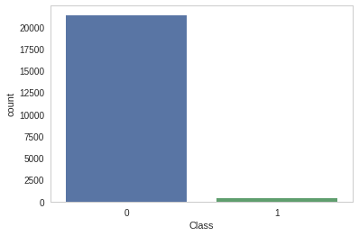
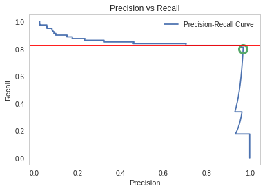
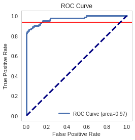

.. title: Evaluating a Model
.. slug: evaluating-a-model
.. date: 2017-06-12 15:05
.. tags: machinelearning kaggle
.. link: 
.. description: Predicting credit card fraud.
.. type: text
.. author: hades

In this assignment you will train several models and evaluate how effectively they predict instances of credit-card fraud using data based on `this dataset from Kaggle <https://www.kaggle.com/dalpozz/creditcardfraud>`_. This is their description:

::

    The datasets contains transactions made by credit cards in September 2013 by european cardholders. This dataset presents transactions that occurred in two days, where we have 492 frauds out of 284,807 transactions. The dataset is highly unbalanced, the positive class (frauds) account for 0.172% of all transactions.

    It contains only numerical input variables which are the result of a PCA transformation. Unfortunately, due to confidentiality issues, we cannot provide the original features and more background information about the data. Features V1, V2, ... V28 are the principal components obtained with PCA, the only features which have not been transformed with PCA are 'Time' and 'Amount'. Feature 'Time' contains the seconds elapsed between each transaction and the first transaction in the dataset. The feature 'Amount' is the transaction Amount, this feature can be used for example-dependant cost-senstive learning. Feature 'Class' is the response variable and it takes value 1 in case of fraud and 0 otherwise.

    Given the class imbalance ratio, we recommend measuring the accuracy using the Area Under the Precision-Recall Curve (AUPRC). Confusion matrix accuracy is not meaningful for unbalanced classification.

    The dataset has been collected and analysed during a research collaboration of Worldline and the Machine Learning Group (`http://mlg.ulb.ac.be <http://mlg.ulb.ac.be>`_) of ULB (Université Libre de Bruxelles) on big data mining and fraud detection. More details on current and past projects on related topics are available on `http://mlg.ulb.ac.be/BruFence <http://mlg.ulb.ac.be/BruFence>`_ and `http://mlg.ulb.ac.be/ARTML <http://mlg.ulb.ac.be/ARTML>`_

    Please cite: Andrea Dal Pozzolo, Olivier Caelen, Reid A. Johnson and Gianluca Bontempi. Calibrating Probability with Undersampling for Unbalanced Classification. In Symposium on Computational Intelligence and Data Mining (CIDM), IEEE, 2015

Each row in \`fraud\_data.csv\` corresponds to a credit card transaction. Features include confidential variables \`V1\` through \`V28\` as well as \`Amount\` which is the amount of the transaction.

The target is stored in the \`class\` column, where a value of 1 corresponds to an instance of fraud and 0 corresponds to an instance of not fraud.

1 Imports
---------

.. code:: ipython

    import numpy
    import pandas
    import matplotlib.pyplot as plot
    import seaborn

    from sklearn.model_selection import (
        GridSearchCV,
        train_test_split,
        )
    from sklearn.svm import SVC
    from sklearn.dummy import DummyClassifier
    from sklearn.linear_model import LogisticRegression
    from sklearn.metrics import (
        auc,
        confusion_matrix,
        precision_recall_curve,
        precision_score,
        recall_score,
        roc_curve,
        )
    from tabulate import tabulate

.. code:: ipython

    DATA = "data/fraud_data.csv"

2 Setup the plotting
--------------------

.. code:: ipython

    get_ipython().magic('matplotlib inline')
    style = seaborn.axes_style("whitegrid")
    style["axes.grid"] = False
    seaborn.set_style("whitegrid", style)

3 Exploring the data
--------------------

3.1 How much fraud is there?
~~~~~~~~~~~~~~~~~~~~~~~~~~~~

Import the data from \`fraud\_data.csv\`. What percentage of the observations in the dataset are instances of fraud?

.. code:: ipython

    data = pandas.read_csv(DATA)

.. code:: ipython

    print("Fraction of cases that were fraud: {0:.2f}".format(data.Class.sum()/data.Class.count()))

::

    Fraction of cases that were fraud: 0.02

.. code:: ipython

    seaborn.countplot(x="Class", data=data)

So it appears that most of the cases aren't fraudulent.

4 Setting up the training and testing sets
------------------------------------------

As always, we split the data into training and testing sets so there's no \`data leakage\`.

.. code:: ipython

    data = pandas.read_csv(DATA)

    X = data.iloc[:,:-1]
    y = data.iloc[:,-1]

    X_train, X_test, y_train, y_test = train_test_split(X, y, random_state=0)

5 Scores
--------

This is a convenience class to store the scores for the models.

.. code:: ipython

    class ScoreKeeper(object):
        """only holds scores, doesn't create them"""
        def __init__(self):
            self.precision = "N/A"
            self.accuracy = "N/A"
            self.recall = "N/A"
            return

        def __sub__(self, other):
            """calculates the difference between the three scores

            Args:
             other (Scores): the right-hand side of the subtraction

            Returns:
             ScoreKeeper: object with the differences

            Raises:
             TypeError: one of the values wasn't set on one of the Scores
            """
            scores = ScoreKeeper()
            scores.accuracy = self.accuracy - other.accuracy
            scores.precision = self.precision - other.precision
            scores.recall = self.recall - other.recall
            return scores

        def __gt__(self, other):
            """compares scores

            Args:
             other (Scores): object to compare to

            Returns:
             bool: True if all three scores are greater than other's

            Raises:
             TypeError: one of the values wasn't set
            """
            return all((self.accuracy > other.accuracy,
                        self.precision > other.precision,
                        self.recall > other.recall))

        def __str__(self):
            return "Precision: {0:.2f}, Accuracy: {1:.2f}, Recall: {2:.2f}".format(
                self.precision,
                self.accuracy,
                self.recall)

.. code:: ipython

    class Scores(ScoreKeeper):
        """holds scores"""
        def __init__(self, model, x_test, y_test):
            """fits and scores the model

            Args:
             model: model that has been fit to the data
             x_test: input for accuracy measurement
             y_test: labels for scoring the model
            """
            self.x_test = x_test
            self.y_test = y_test
            self._accuracy = None
            self._recall = None
            self._precision = None
            self.model = model
            self._predictions = None
            self._scores = None
            return

        @property
        def predictions(self):
            """the model's predictions

            Returns:
             array: predictions for x-test
            """
            if self._predictions is None:
                self._predictions = self.model.predict(self.x_test)
            return self._predictions

        @property
        def accuracy(self):
            """the accuracy of the model's predictions

            the fraction that was correctly predicted
        
            (tp + tn)/(tp + tn + fp + fn)

            Returns:
             float: accuracy of predictions for x-test
            """
            if self._accuracy is None:
                self._accuracy = self.model.score(self.x_test, self.y_test)
            return self._accuracy

        @property
        def recall(self):
            """the recall score for the predictions

            The fraction of true-positives penalized for missing any
            This is the better metric when missing a case is more costly
            than accidentally identifying a case.

            tp / (tp + fn)

            Returns:
             float: recall of the predictions
            """
            if self._recall is None:
                self._recall = recall_score(self.y_test, self.predictions)
            return self._recall

        @property
        def precision(self):
            """the precision of the test predictions

            The fraction of true-positives penalized for false-positives
            This is the better metric when accidentally identifying a case
            is more costly than missing a case

            tp / (tp + fp)

            Returns:
             float: precision score
            """
            if self._precision is None:
                self._precision = precision_score(self.y_test, self.predictions)
            return self._precision

6 A Dummy Classifier (baseline)
-------------------------------

Using \`X\_train\`, \`X\_test\`, \`y\_train\`, and \`y\_test\` (as defined above), we're going to train a `dummy classifier <http://scikit-learn.org/stable/modules/generated/sklearn.dummy.DummyClassifier.html>`_ that classifies everything as the majority class of the training data, so we will have a baseline to compare with the other models.

First we create and train it

.. code:: ipython

    strategy = "most_frequent"
    dummy = DummyClassifier(strategy=strategy)
    dummy.fit(X_train, y_train)
    dummy_scores = Scores(dummy, X_test, y_test)

Now we make our predctions and score them

.. code:: ipython

    print("Dummy Classifier: {0}".format(dummy_scores))

::

    Dummy Classifier: Precision: 0.00, Accuracy: 0.99, Recall: 0.00

Since the model is always predicting that the data-points are not fraudulent (the majority case), it never returns any true positives and since both precision and recall have true positive as their numerators, they are both 0.

For the accuracy we can look at the count of each class:

.. code:: ipython

    y_test.value_counts()

::

    0    5344
    1      80
    Name: Class, dtype: int64

And since we know it will always predict 0, we can double-check it (the true and false positives are both 0).

.. code:: ipython

    true_positive = 0
    true_negative = 5344
    false_positive = 0
    false_negative = 80
    accuracy = (true_positive + true_negative)/(true_positive + true_negative
                                                + false_positive + false_negative)
    print("Accuracy: {0:.2f}".format(accuracy))
    assert round(accuracy, 2) == round(dummy_scores.accuracy, 2)

::

    Accuracy: 0.99

7 SVC Accuracy, Recall and Precision
------------------------------------

Now we're going to create a `Support Vector Classifier <http://scikit-learn.org/stable/modules/generated/sklearn.svm.SVC.html>`_ that uses the sklearn default valuse.

.. code:: ipython

    svc = SVC()
    svc.fit(X_train, y_train)
    svc_scores = Scores(svc, X_test, y_test)

.. code:: ipython

    print("SVC: {0}".format(svc_scores))

::

    SVC: Precision: 1.00, Accuracy: 0.99, Recall: 0.38

We can now compare it to the Dummy Classifier to see how it did against the baseline.

.. code:: ipython

    print("SVC - Dummy: {0}".format(svc_scores - dummy_scores))
    assert svc_scores > dummy_scores

::

    SVC - Dummy: Precision: 1.00, Accuracy: 0.01, Recall: 0.38

The SVC was much better on precision and recall (as expected) and slightly better on accuracy.

8 Confusion Matrix
------------------

We're going to create a Support Vector Classifier with \`\`C=1e9\`\` and \`\`gamma=1e-07\`\` (the \`\`e\`\` is the equivalent of \`\`\*\*\`\`). Then, using the `decision function <http://scikit-learn.org/stable/modules/generated/sklearn.svm.SVC.html#sklearn.svm.SVC.decision_function>`_ and a threshold of -220, we're going to make our predictions and create a confusion matrix. The decision-function calculates the distance of each data point from the label, so the further a value is from 0, the further it is from the separating hyper-plane.

.. code:: ipython

    error_penalty = 1e9
    kernel_coefficient = 1e-07
    threshold = -220

.. code:: ipython

    svc_2 = SVC(C=error_penalty, gamma=kernel_coefficient)
    svc_2.fit(X_train, y_train)
    svc_scores_2 = Scores(svc_2, X_test, y_test)

The decision\_function gives us the distances which we then need to convert to labels. In this case we're going to label anything greater than -220 as a 1 and anything less as a 0.

.. code:: ipython

    decisions = svc_2.decision_function(X_test)
    decisions[decisions > threshold] = 1
    decisions[decisions != 1] = 0
    matrix = confusion_matrix(y_test, decisions)
    matrix = pandas.DataFrame(matrix, index=["Actual Positive", "Actual Negative"], columns = ["Predicted Positive", "Predicted Negative"])
    print(tabulate(matrix, tablefmt="orgtbl",
                   headers="keys"))

.. table::

    +-----------------+--------------------+--------------------+
    | \               | Predicted Positive | Predicted Negative |
    +=================+====================+====================+
    | Actual Positive |               5320 |                 24 |
    +-----------------+--------------------+--------------------+
    | Actual Negative |                 14 |                 66 |
    +-----------------+--------------------+--------------------+

.. code:: ipython

    print("SVC 2: {0}".format(svc_scores_2))
    assert svc_scores_2 > dummy_scores

::

    SVC 2: Precision: 0.94, Accuracy: 1.00, Recall: 0.80

.. code:: ipython

    print("SVC 2 - SVC Default: {0}".format(svc_scores_2 - svc_scores))

::

    SVC 2 - SVC Default: Precision: -0.06, Accuracy: 0.01, Recall: 0.43

This model did slightly worse with precision that the default, slightly better for accuracy but quite a bit better for recall. So if we didn't care as much about false positives it would be the better model.

9 Logistic Regression
---------------------

This model will be a Logistic Regression model built with the default parameters.

For the logisitic regression classifier, we'll create a precision recall curve and a roc curve using y\_test and the probability estimates for X\_test (probability it is fraud).

Looking at the precision recall curve, what is the recall when the precision is \`0.75\`?
Looking at the roc curve, what is the true positive rate when the false positive rate is \`0.16\`?

.. code:: ipython

    model = LogisticRegression()
    model.fit(X_train, y_train)
    y_scores = model.decision_function(X_test)
    precision, recall, thresholds = precision_recall_curve(y_test, y_scores)
    closest_zero = numpy.argmin(numpy.abs(thresholds))
    closest_zero_precision = precision[closest_zero]
    closest_zero_recall = recall[closest_zero]
    index = numpy.where(precision==0.75)[0][0]
    recall_at_precision = recall[index]
    figure = plot.figure()
    axe = figure.gca()
    axe.plot(precision, recall, label="Precision-Recall Curve")
    axe.plot(closest_zero_precision, closest_zero_recall, "o", markersize=12, mew=3, fillstyle='none')
    axe.set_xlabel("Precision")
    axe.set_ylabel("Recall")
    axe.axhline(recall_at_precision, color="r")
    axe.legend()
    title = axe.set_title("Precision vs Recall")

.. code:: ipython

    index = numpy.where(precision==0.75)[0][0]
    recall_at_precision = recall[index]
    print("Recall at precision 0.75: {0}".format(recall_at_precision))

::

    Recall at precision 0.75: 0.825

When the precision is 0.75, the recall is 0.825.

.. code:: ipython

    y_score_lr = model.predict_proba(X_test)
    false_positive_rate, true_positive_rate, _ = roc_curve(y_test, y_score_lr[:, 1])
    area_under_the_curve = auc(false_positive_rate, true_positive_rate)
    index = numpy.where(numpy.round(false_positive_rate, 2)==0.16)[0][0]
    figure = plot.figure()
    axe = figure.gca()
    axe.plot(false_positive_rate, true_positive_rate, lw=3, label="ROC Curve (area={0:.2f})".format(area_under_the_curve))
    axe.axhline(true_positive_rate[index], color='r')
    axe.set_xlabel("False Positive Rate")
    axe.set_ylabel("True Positive Rate")
    axe.set_title("ROC Curve")
    axe.plot([0, 1], [0, 1], color='navy', lw=3, linestyle='--')
    axe.legend()
    axe.set_aspect('equal')

.. code:: ipython

    index = numpy.where(numpy.round(false_positive_rate, 2)==0.16)[0][0]
    print("True positive rate where false positive rate is 0.16: {0}".format(true_positive_rate[index]))

::

    True positive rate where false positive rate is 0.16: 0.9375

def true\_positive\_where\_false(model, threshold):
    """get the true-positive value matching the threshold for false-positive

Args:
 model: the model fit to the data with predict\_proba method

Return:
 float: True Positive rate
"""
y\_score\_lr = model.predict\_proba(X\_test)
false\_positive\_rate, true\_positive\_rate, \_ = roc\_curve(y\_test, y\_score\_lr[:, 1])
index = numpy.where(numpy.round(false\_positive\_rate, 2)==0.16)[0][0]
return true\_positive\_rate[index]

def recall\_where\_precision(model, threshold):
    """return recall where the first precision matches threshold

Args:
 model: model fit to the data with decision\_function
 threshold (float): point to find matching recall

Returns:
 float: recall matching precision threshold
"""
y\_scores = model.decision\_function(X\_test)
precision, recall, thresholds = precision\_recall\_curve(y\_test, y\_scores)
return recall[numpy.where(precision==threshold)[0][0]]

def answer\_five():
    model = LogisticRegression()
    model.fit(X\_train, y\_train)
    recall\_score = recall\_where\_precision(model, 0.75)
    true\_positive = true\_positive\_where\_false(model, threshold=0.16)
    return (recall\_score, true\_positive)

answer\_five()

parameters = dict(penalty=["l1", "l2"], C=[10\*\*power for power in range(-2, 3)])
model = LogisticRegression()

grid = GridSearchCV(model, parameters, scoring="recall")
grid.fit(X\_train, y\_train)

grid.cv\_results\_

len(grid.cv\_results\_["mean\_test\_score"])

grid.cv\_results\_
l1 = [grid.cv\_results\_["mean\_test\_score"][index] for index in range(0, len(grid.cv\_results\_['mean\_test\_score']), 2)]
l2 = [grid.cv\_results\_["mean\_test\_score"][index] for index in range(1, len(grid.cv\_results\_["mean\_test\_score"])+ 1, 2)]
l1

l2

def answer\_six():    
    parameters = dict(penalty=["l1", "l2"], C=[10\*\*power for power in range(-2, 3)])
    model = LogisticRegression()
    grid = GridSearchCV(model, parameters, scoring="recall")
    grid.fit(X\_train, y\_train)
    l1 = [grid.cv\_results\_["mean\_test\_score"][index] for index in range(0, len(grid.cv\_results\_['mean\_test\_score']), 2)]
    l2 = [grid.cv\_results\_["mean\_test\_score"][index] for index in range(1, len(grid.cv\_results\_["mean\_test\_score"])+ 1, 2)]
    return numpy.array([l1, l2]).T

answer\_six()

def GridSearch\_Heatmap(scores):
    get\_ipython().magic('matplotlib inline')
    import seaborn as sns
    import matplotlib.pyplot as plt
    plt.figure()
    scores = answer\_six()
    sns.heatmap(scores, xticklabels=['l1','l2'], yticklabels=[0.01, 0.1, 1, 10, 100])
    plt.yticks(rotation=0);

if VERBOSE:
    GridSearch\_Heatmap(answer\_six())
